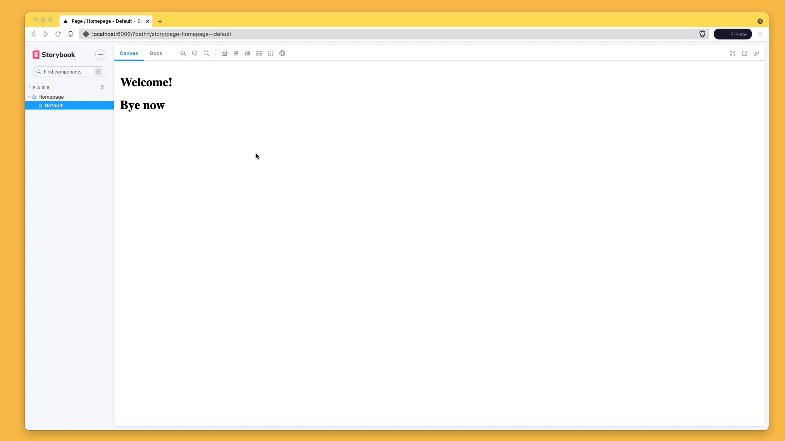

# Next.js-Storybook-i18next Example

This POC demonstrates a full working setup of Next.js, Storybook and i18next
(with [next-i18next](https://github.com/isaachinman/next-i18next)) and Webpack@5.
It uses [storybook-addon-i18next](https://www.npmjs.com/package/storybook-addon-i18next).

## How to start

### Storybook

```bash
yarn # or npm i
yarn storybook # or npm run storybook
```

### Next.js

```bash
yarn # or npm i
yarn dev # or npm run dev
```

Add `/de` to the URL to see the German version.

## Example

Click on the globe to switch languages.



## Thank you

Inspired by and building on [Piepongwong's POC]( https://github.com/Piepongwong/gatsby_nextjs_storybook_i18n_scaffolding).
